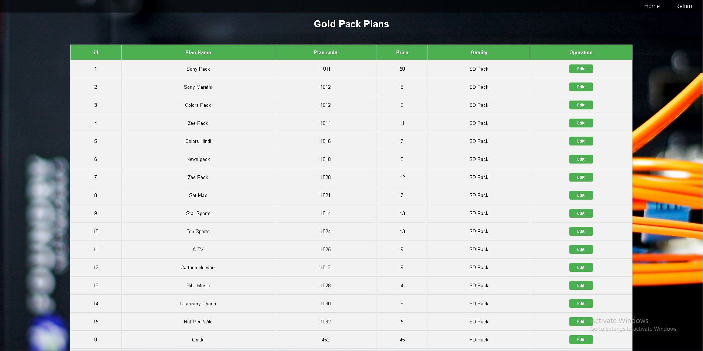

# Cable-Management-System
Dish TV Management system

The Cable Managment System aims to facilitate the business processes of cable service providers and end-users. The system provides simple interfaces to end-users for registration, login, and service management while ensuring that these processes are easy, secure, and effective.

## Features

- **User Registration and Login**:
--Customers can register with their details and access their accounts securely.

- **Admin Panel**:
--Allows administrators to:
--Manage user accounts and registration data.
--Update service records.
--View and resolve customer queries.

- **Security Features**:
--Password validation with rules (e.g., minimum length, special characters).
--Secure login with encrypted passwords.
--Username availability check to prevent duplicates.

- **Scalability**: The system can be expanded to include features like payment management, subscription tracking, and customer notifications.


## Technologies Used

-**Frontend**: HTML, CSS (with Bootstrap for styling), and JavaScript.
-**Backend**: PHP for server-side logic.
-**Database**: MySQL, managed using XAMPP for local development.

## Getting Started

To run the Cable Management System on your local machine, follow these steps:

1. Clone the repository:

   ```bash
   git clone https://github.com/OMRG-01/Cable-Management-System.git
   ```
   
2. Set up your database using Xampp MySQL Admin
 
3. Database Name:- "responsiveform" ,Then Import "responsiveform.sql" in DB

4. You may need to configure the database connection in the project. check "connection.php" code

5. Compile and run the application.

6. Open Localhost
 
7. Use the application to manage Customer Needs and Admin Functionality.

## Usage

Here's a brief overview of how to use the Hospital Management System:

- **Customer**:
- Register Customer.
- Update There Details
- See Updated Planes
- Pay For Plan
- Generate Invoice  

- **Admin**:
- Need Login Credentials (check :- "responsiveform.sql")
- Manage Plans
- Manage Worker
- Manage Customer
- Manage Request
- Invoice 


- **Dashboard**: Admin, User and New Registration Log In Pages.


## Screenshots
Index


New Registration 


Admin Log In


**User**

User Dashboard


Update Details 


Subscription 


Gold Pack Details


Premium Pack Details


Pay


Generate Invoice


About Us


**Admin**

Admin Dashboard


See Worker


See Customer


Update Customer


Add Plans


Add Plan Interface


Update Subscription


Update Subscription Interface


Manage Invoice


Generate Invoice


## Acknowledgments

Thank you to all the contributors and open source projects that have made this project possible.

## Contact

If you have any questions or need assistance, please feel free to contact us:
- email: omgawali2003@gmail
- Project Link: [click here]([https://github.com/OMRG-01/Cable-Management-System.git])

We hope this Cable Management System is helpful for managing Cable operations efficiently.
